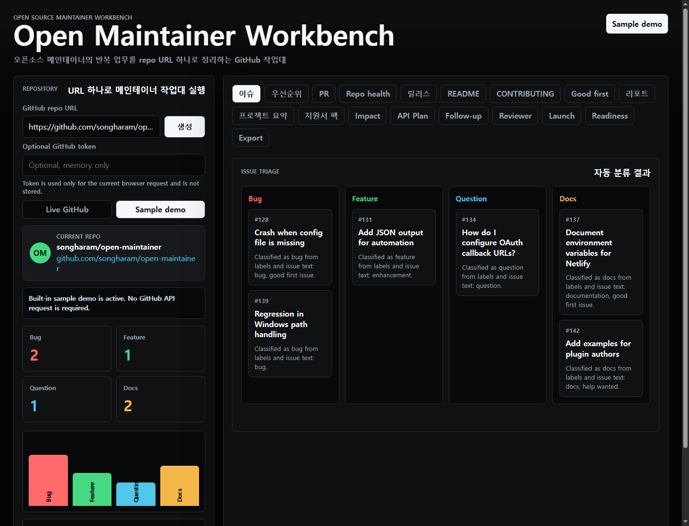

# Open Maintainer Workbench

[](https://github.com/songharam/open-maintainer/actions/workflows/ci.yml)
[](./LICENSE)

Open Maintainer Workbench는 오픈소스 메인테이너가 반복적으로 처리하는 이슈 triage, PR 리뷰 준비, 릴리스 문서 작성, 신규 기여자 온보딩을 한 화면에서 정리하는 정적 웹앱입니다. GitHub 저장소 URL만 입력하면 이슈 분류, 우선순위 브리프, PR 리뷰 체크리스트, 릴리스 노트 초안, README 개선안, CONTRIBUTING.md 초안, good first issue 추천, 주간 리포트, 지원 신청 답변 패키지, 전체 Markdown export를 바로 얻을 수 있습니다.



## Demo

- Netlify 배포: `maintainer-workbench-netlify.zip`을 Netlify에 업로드하면 바로 실행됩니다.
- GitHub Pages 선택 배포: 저장소 Settings에서 Pages source를 GitHub Actions로 설정한 뒤 `Deploy GitHub Pages` workflow를 수동 실행하세요.
- Sample demo: 앱에서 `Sample demo`를 선택하거나 URL에 `?demo=sample`을 붙이면 GitHub API 없이 풍부한 예시 워크로드를 바로 볼 수 있습니다.

## 핵심 기능

- 이슈 자동 분류: `bug`, `feature`, `question`, `docs`
- PR 리뷰 체크리스트 생성
- 이번 주 우선순위 브리프 생성
- GitHub 저장소 운영 체크리스트 생성
- 릴리스 노트 초안 생성
- README 개선안 생성
- CONTRIBUTING.md 초안 생성
- good first issue 추천
- 메인테이너 주간 리포트 생성
- 프로젝트 공유 및 지원용 요약 생성
- 500자 제한에 맞춘 지원 신청 답변 패키지 생성
- Application readiness score and submission checklist
- Ecosystem impact brief with stars, forks, license, topics, and support fit score
- API credit usage plan with use cases, guardrails, and success metrics
- Application follow-up plan with evidence refresh checklist and email draft
- Reviewer packet with a two-minute review path and evidence checklist
- Launch kit with Netlify ZIP, GitHub Pages, demo URL, screenshot, and verification handoff
- 전체 산출물 Markdown 복사 및 다운로드
- 공개 GitHub 저장소의 Issues, Pull Requests, Releases live 읽기
- 선택적 GitHub token 입력 지원: 브라우저 메모리에서만 사용하고 저장하지 않음
- `Live GitHub` / `Sample demo` 데이터 모드 전환
- API 실패, rate limit, 빈 저장소 상태 표시
- GitHub API 실패 시 예시 데이터 fallback

## 저장소 운영

- CI: GitHub Actions에서 `npm test`와 `npm run check` 실행
- 이슈 템플릿: bug, feature, docs, question 분리
- PR 템플릿: maintainer impact와 validation 체크
- 기여 가이드: [CONTRIBUTING.md](./CONTRIBUTING.md)
- 보안 정책: [SECURITY.md](./SECURITY.md)
- 데모 진행 가이드: [docs/demo-script.md](./docs/demo-script.md)
- GitHub 저장소 업그레이드 가이드: [docs/github-repository-upgrade.md](./docs/github-repository-upgrade.md)
- 로드맵: [docs/roadmap.md](./docs/roadmap.md)
- 아키텍처: [docs/architecture.md](./docs/architecture.md)
- GitHub API 연결 계획: [docs/github-api-integration.md](./docs/github-api-integration.md)

## 실행

정적 파일만으로 실행됩니다.

```bash
npm test
npm run check
```

ES module import를 사용하므로 정적 서버 또는 Netlify 같은 호스팅 환경에서 실행하세요.

```bash
npm ci
npm test
npm run check
python3 -m http.server 4173
```

## 구조

```text
.
├── app.js
├── index.html
├── styles.css
├── src
│   ├── analyzer.js
│   ├── demo-mode.js
│   ├── sample-data.js
│   └── providers
│       ├── github-provider.js
│       └── sample-provider.js
├── tests
│   ├── analyzer.test.mjs
│   ├── demo-mode.test.mjs
│   └── github-provider.test.mjs
├── docs
│   ├── codex-application-copy.md
│   ├── codex-application-summary.md
│   └── github-repository-upgrade.md
├── .github
│   ├── ISSUE_TEMPLATE
│   ├── PULL_REQUEST_TEMPLATE.md
│   └── workflows/ci.yml
├── CHANGELOG.md
├── CODE_OF_CONDUCT.md
├── CONTRIBUTING.md
├── screenshots
│   └── maintainer-workbench.png
├── SECURITY.md
├── SUPPORT.md
├── LICENSE
├── netlify.toml
└── package.json
```

## Live GitHub Mode

앱은 기본적으로 공개 GitHub 저장소를 live mode로 읽습니다. GitHub token은 코드에 저장하지 않으며, 현재 구현은 공개 저장소의 unauthenticated REST API만 사용합니다.

`src/providers/github-provider.js`는 다음 데이터를 기존 snapshot 형식으로 변환합니다.

- Repository metadata: `/repos/{owner}/{repo}`
- Open issues: `/repos/{owner}/{repo}/issues`
- Open pull requests: `/repos/{owner}/{repo}/pulls`
- Pull request files: `/repos/{owner}/{repo}/pulls/{pull_number}/files`
- Releases: `/repos/{owner}/{repo}/releases`

GitHub API가 rate limit, network error, not found로 실패하면 UI에 원인을 표시하고 `src/providers/sample-provider.js`의 예시 데이터로 fallback합니다. 공개 저장소에 open issue, open pull request, release가 없으면 `Live GitHub empty` 상태를 표시합니다.

UI와 분석 로직은 provider에 직접 의존하지 않고 snapshot만 받도록 분리되어 있어 Codex/API 기반 분석으로 확장하기 쉽습니다.

## Netlify 배포

이 저장소 루트를 Netlify에 업로드하거나 제공된 ZIP 파일을 드래그 앤 드롭하면 됩니다. 별도 빌드 명령은 필요하지 않습니다.

## GitHub Pages 배포

GitHub Pages workflow는 저장소 Pages 설정이 활성화된 뒤 수동으로 실행합니다.

1. GitHub 저장소에서 `Settings` -> `Pages`로 이동합니다.
2. Build and deployment source를 `GitHub Actions`로 설정합니다.
3. `Actions` -> `Deploy GitHub Pages` -> `Run workflow`를 실행합니다.
4. 배포가 완료되면 GitHub Pages URL이 workflow summary에 표시됩니다.

## 라이선스

MIT License
