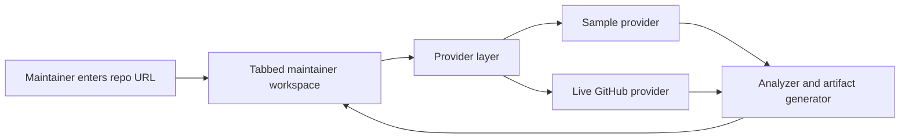

# Architecture

Open Maintainer Workbench is intentionally small: a static UI, deterministic analyzer, and swappable data providers.



## Modules

- `index.html`: static document shell and result panels.
- `styles.css`: black-based responsive interface.
- `app.js`: browser UI orchestration.
- `src/analyzer.js`: repository identity parsing, issue classification, good first issue scoring, and maintainer artifact generation.
- `src/demo-mode.js`: deterministic helpers for `Live GitHub` and `Sample demo` mode selection.
- `src/sample-data.js`: no-auth demo dataset.
- `src/providers/sample-provider.js`: returns the demo snapshot.
- `src/providers/github-provider.js`: live GitHub API provider for public repository data.
- `tests/analyzer.test.mjs`: behavior tests for parsing, classification, and artifact generation.
- `tests/demo-mode.test.mjs`: tests for demo query parameter and mode label handling.
- `tests/github-provider.test.mjs`: provider tests for normalization and API error handling.

## Data Shape

Providers should return a repository snapshot:

```js
{
  repository: {
    description: "",
    stars: 0,
    forks: 0,
    openIssues: 0,
    defaultBranch: "main",
    license: "MIT",
    topics: []
  },
  issues: [],
  pullRequests: [],
  releases: []
}
```

The analyzer receives that snapshot and returns UI-ready strings and structured lists, including issue triage, PR review checklist, repository health checklist, release notes, README suggestions, CONTRIBUTING draft, good first issue recommendations, weekly report, project summary, ecosystem impact brief, API credit usage plan, support application pack, application readiness score, and Markdown export. The UI does not need to know whether data came from sample mode or GitHub API mode.

## Design Constraints

- Static-first deployment.
- No GitHub token required for the demo.
- Deterministic output for easy review.
- Provider boundary ready for real API data.
- Small modules that are easy for contributors to understand.
