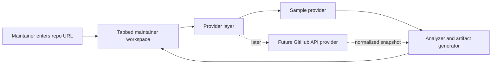

# Architecture

Open Maintainer Workbench is intentionally small: a static UI, deterministic analyzer, and swappable data providers.



## Modules

- `index.html`: static document shell and result panels.
- `styles.css`: black-based responsive interface.
- `app.js`: browser UI orchestration.
- `src/analyzer.js`: repository identity parsing, issue classification, good first issue scoring, and maintainer artifact generation.
- `src/sample-data.js`: no-auth demo dataset.
- `src/providers/sample-provider.js`: returns the demo snapshot.
- `src/providers/github-provider.js`: future GitHub API integration boundary.
- `tests/analyzer.test.mjs`: behavior tests for parsing, classification, and artifact generation.

## Data Shape

Providers should return a repository snapshot:

```js
{
  issues: [],
  pullRequests: [],
  releases: []
}
```

The analyzer receives that snapshot and returns UI-ready strings and structured lists. The UI does not need to know whether data came from sample mode or GitHub API mode.

## Design Constraints

- Static-first deployment.
- No GitHub token required for the demo.
- Deterministic output for easy review.
- Provider boundary ready for real API data.
- Small modules that are easy for contributors to understand.
